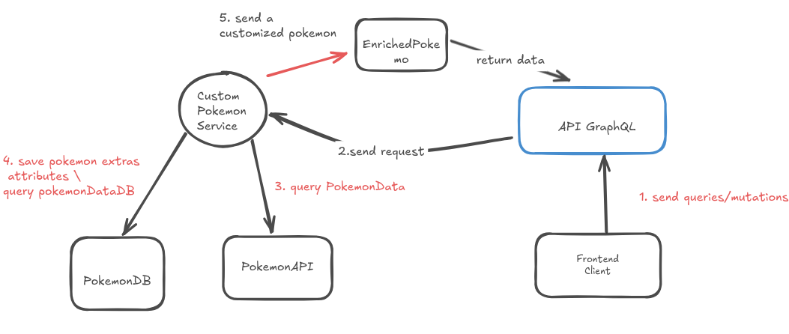
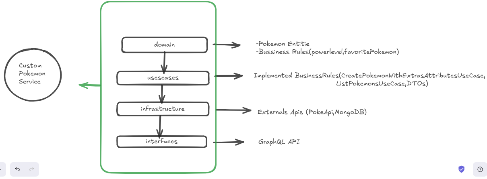

# Custom Pokemon Service

## What is it?

The Custom Pokemon Service is a service that creates a customized pokemon based in PokeAPI data with extras attributtes saved in database. This extras attributtes are: nickname, powerLevel and favorite. The pokemon result after this combination is a enriched pokemons wit following structure:

```bash
id
name
height
weight
types
nickname
favorite
powerLevel
```
## Service Description

This service is a Node.js application that provides a GraphQL interface for managing Pokémon information.

Main Features:
1. **Pokémon List**:
- Fetches official data from PokeAPI.
- Returns paginated lists of Pokémon, which can include additional attributes saved in MongoDB.

2. **Registering and Updating Additional Attributes**:
- Allows you to add or update additional information about a Pokémon in MongoDB.
- Respects business rules, such as a maximum of 3 favorite Pokémon and `powerLevel` values ​​between 1 and 100.


## Tecnical Requirements

- Node.js (minimum v16)
- GraphQL (Apollo Server or Yoga)
- MongoDB (Mongoose or native driver)
- Jest for testing
- Integration with PokeAPI to retrieve official Pokémon data


## Archictecture

To build the solution of this challenge the following architecture was thought:



### Layered Architecture
Below is the diagram representing the organization of `custom-pokemon-service` following the principles of Clean Architecture:

**Execution Flow:**
1. Client sends queries or mutations to the API.
2. The API communicates with the Custom Pokemon Service.
3. If the operation is to retrieve data from the PokeApi, access PokeApi and return data.
4. If the operation is to save/change/search, access PokemonDB (in MongoDB).
5. Always returns an enriched Pokemon to the client.

### Details about Schema GraphQL

```bash
type Pokemon {
id: ID!
name: String!
height: Int
weight: Int
types: [String!]!
# Atributos extras (MongoDB)
nickname: String
favorite: Boolean
powerLevel: Int
}
```
## Build and Run 

### Build

To build the service's Docker image, run:
```bash
docker-compose build
```

### Running the service

After building, start the service with:

```bash
docker-compose up
```
This will start the GraphQL API along with MongoDB (configured in docker-compose.yml).


## Accessing data via the API

### Send a query
```graphql
query { 
    pokemons(page:4, limit:10) { 
        id 
        name 
        powerLevel 
        favorite 
    } 
}
```

Send via curl:

```grapgql
curl -X POST http://localhost:4000/ \
  -H "Content-Type: application/json" \
  -d '{"query":"query { pokemons(page:4, limit:10) { id name powerLevel favorite } }"}'
```
expect output:
```json

    {                                                                                                                                                                       
  "data": {                                                                                                                                                             
    "pokemons": [                                                                                                                                                       
      {                                                                                                                                                                 
        "id": "1",                                                                                   
        "name": "bulbasaur",                                                                                                                                            
        "powerLevel": null,                                                                                                                                             
        "favorite": false                                                                                                                                               
      },                                                                                                                                                                
      {                                                                                                                                                                 
        "id": "2",                                                                                                                                                      
        "name": "ivysaur",                                                                                                                                              
        "powerLevel": null,                                                                                                                                             
        "favorite": false                                                                                                                                               
      },  
      {...}, 
      {
        "id": "12",
        "name": "butterfree",
        "powerLevel": null,
        "favorite": false
      },
      {
        "id": "13",
        "name": "weedle",
        "powerLevel": null,
        "favorite": false
      },
      {
        "id": "14",
        "name": "kakuna",
        "powerLevel": null,
        "favorite": false
      },
      {
        "id": "15",
        "name": "beedrill",
        "powerLevel": null,
        "favorite": false
      },
      {
        "id": "16",
        "name": "pidgey",
        "powerLevel": null,
        "favorite": false
      },
      {
        "id": "17",
        "name": "pidgeotto",
        "powerLevel": null,
        "favorite": false
      },
      {
        "id": "18",
        "name": "pidgeot",
        "powerLevel": null,
        "favorite": false
      },
      {
        "id": "19",
        "name": "rattata",
        "powerLevel": null,
        "favorite": false
      },
      {
        "id": "20",
        "name": "raticate",
        "powerLevel": null,
        "favorite": false
      }
    ]
  }
}

```
### Send a mutation


```graphql
mutation{
  
  createPokemonAttributes(input:{
    pokemonName: "cascoon"
    nickname: "cascaozinho"
    favorite: false
    powerLevel: 1

  }){
    
    id
    name
    nickname
    favorite
    powerLevel
   
  }
}
```
Send via curl:
```bash
curl -s -X POST http://localhost:4000/ \
  -H "Content-Type: application/json" \
  -d '{"query":"mutation { createPokemonAttributes(input: { pokemonName: \"cascoon\", nickname: \"cascaozinho\", favorite: false, powerLevel: 1 }) { id name nickname favorite powerLevel } }"}' 

```
expected output
```json
{
  "data": {
    "createPokemonAttributes": {
      "id": "268",
      "name": "cascoon",
      "nickname": "cascaozao",
      "favorite": false,
      "powerLevel": 1
    }
  }
}

```
## Future Improvemets


